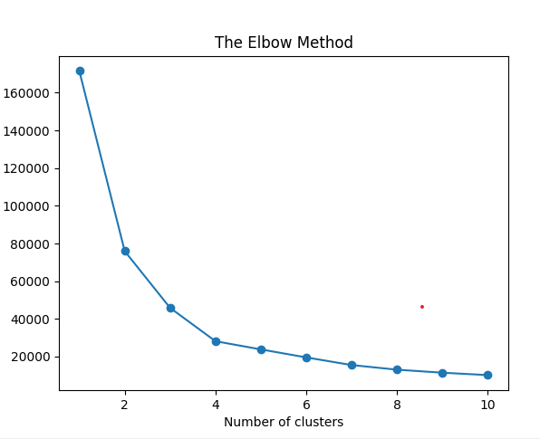
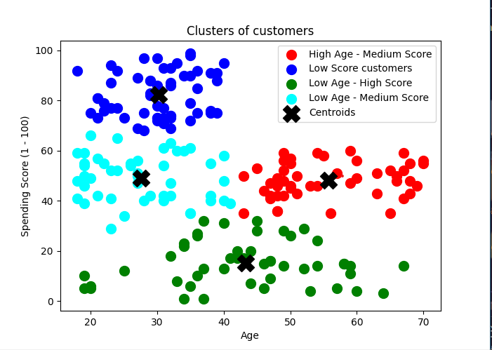

#  Mall Customer Segmentation Using Unsupervised Learning Clustering

 1. ## Data Collection and Preprocessing:
     Collect  mall customer segmentation data from Kaggle with customer demographics, purchase history, visit frequency, time spent in the mall, etc.
Preprocess the data by handling missing values, encoding categorical variables, and scaling numerical features.

 2. ## Feature Selection:
     Identify the features that are most relevant for clustering. Consider factors such as age, income, spending habits, and visit frequency.

 3. ## Choose a Clustering Algorithm:
     Select an appropriate clustering algorithm based on your data and requirements. Common choices include K-Means, Hierarchical Clustering, and DBSCAN.

 4. ## Determine the Number of Clusters (K):
     Use techniques like the elbow method or silhouette analysis to find the optimal number of clusters for your data.

 5. ## Implement Clustering Algorithm:
     Apply the chosen clustering algorithm to group customers into clusters based on their features.

 6. ## Analyze and Interpret Clusters:
     Examine the characteristics of each cluster to understand the different customer segments.
     Identify key traits that define each cluster, such as high spenders, frequent visitors, or budget-conscious shoppers.

 7. ## Profile Customer Segments:
     Create detailed profiles for each cluster, summarizing the common traits and behaviors of customers within each group.

 8. ## Target Market Campaign:
     Based on the identified customer segments, design targeted marketing campaigns tailored to the preferences and behaviors of each cluster.
    Customize promotions, discounts, or communication strategies to resonate with the specific needs of each segment.

 9. ## Evaluate and Iterate:
     - Measure the effectiveness of your marketing campaigns by analyzing customer responses and sales data.
    Iterate on your segmentation and marketing strategies based on the feedback and results.
     - ### Tools and Libraries:
     - Use Python with libraries like scikit-learn, pandas, and matplotlib for data manipulation, clustering, and visualization.

### Using the elbow method to find the optimal number of clusters

From the above plot,  the optimal number of clusters are 4.

## KMeans Clustering

From the above plot,  there are 4 clusters.

- High Age - Medium Score customers: From this cluster, we can see that the customers belonging to this cluster belong to 40+ age group and have a 35 - 60 spending score.
- Low Score customers: These are the customers that do not spend a lot in the mall. The target of the mall should be to reduce the number of customers in the blue cluster.
- Low Age - High Score customers: From this cluster, we can see that the customers belonging to this cluster belong to <40 age group and have a spending score greater than 70.
- Low Age - Medium Score customers: From this cluster, we can see that the customers belonging to this cluster belong to <40 age and have a spending score in the range of 35 and 65.

## Conclusion

The aim of the mall is to increase the customers present in the cluster 'High Income - High Score' by reducing the customers present in the cluster 'High Income - Low Score' and also to migrate the customers present in the cluster 'Medium Income - Medium Score' to higher spending scores.