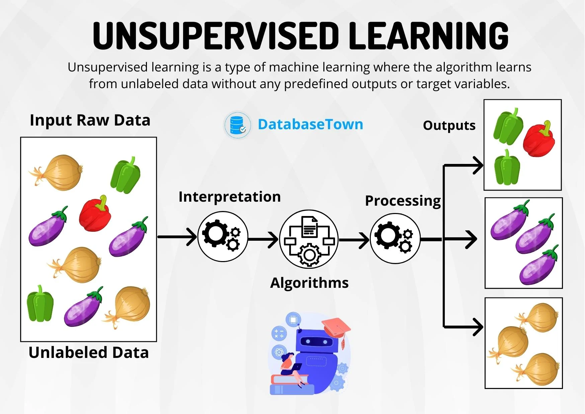

# Unsupervised Machine Learning

## 1. What is unsupervised machine learning ?

Unsupervised machine learning is a type of machine learning where the algorithm is given data without explicit instructions on what to do with it. Unlike supervised learning, where the algorithm is trained on labeled data with input-output pairs, unsupervised learning involves working with unlabeled data.

- The goal of unsupervised learning is to discover patterns, relationships, or structures within the data without predefined labels.
- Unsupervised learning is particularly useful when dealing with large datasets where manually labeling the data would be impractical or too costly. It can help uncover hidden patterns, identify relationships between variables, and provide insights into the structure of the data. Common applications of unsupervised learning include customer segmentation, anomaly detection, and data compression.

## 2.Why use unsupervised machine learning ?

- Exploratory Data Analysis:Unsupervised learning is valuable for exploring and understanding the inherent structure of a dataset. By identifying patterns, relationships, and clusters within the data, analysts and data scientists can gain insights into the nature of the information they are working with.

- Data Preprocessing: Before applying supervised learning algorithms, unsupervised techniques like dimensionality reduction can be employed to reduce the complexity of the dataset. This can lead to faster training times and better performance for subsequent supervised models.

- Anomaly Detection: Unsupervised learning is effective in identifying anomalies or outliers in a dataset. This is particularly useful in applications such as fraud detection, network security, or quality control, where detecting unusual patterns can be critical.

- Clustering: Grouping similar data points together can reveal natural divisions within the data, aiding in tasks such as customer segmentation, market basket analysis, or organizing large datasets.

- Feature Learning: Unsupervised learning can be used to automatically discover relevant features in the data. This is beneficial when dealing with high-dimensional datasets, where identifying the most informative features can be challenging.

- Recommendation Systems: Unsupervised learning methods can be applied to understand user behavior and preferences, enabling the development of recommendation systems that suggest items or content based on similarity to user profiles.

- Biological and Neural Network Modeling: Unsupervised learning algorithms have been used to model biological and neural systems. For example, clustering techniques are applied to categorize genes based on expression patterns, and dimensionality reduction methods can help analyze neural activity data.

- Reducing Data Dimensionality: Dimensionality reduction techniques, such as Principal Component Analysis (PCA), are often used to reduce the number of features in a dataset while retaining important information. This can be especially helpful in cases where the original data has many variables or features.

## 3. Working of unsupervised machine learning ?

The working of unsupervised machine learning involves discovering patterns, relationships, or structures within a dataset without the explicit guidance of labeled output. Here is a general overview of how unsupervised learning algorithms work:

### Input Data:

Unsupervised learning starts with a dataset that consists of input features but lacks corresponding output labels or target values.
Each data point in the dataset represents an observation or instance with various features.

### Model Training:

Unlike supervised learning, there is no specific target variable to predict in unsupervised learning.
The algorithm explores the data and learns patterns or structures inherent in the dataset.

### Clustering or Dimensionality Reduction:

Depending on the specific task, unsupervised learning involves either clustering similar data points together or reducing the dimensionality of the dataset.
In clustering, algorithms aim to group data points that share similarities, creating clusters or groups of related instances.
In dimensionality reduction, the goal is to reduce the number of features while retaining the essential information in the data.

### Output:

The output of unsupervised learning may include cluster assignments (for clustering algorithms) or a reduced set of features (for dimensionality reduction algorithms).
For clustering, each data point is assigned to a cluster, and the algorithm provides information about the relationships between different clusters.
For dimensionality reduction, the output is a transformed representation of the data with fewer features.

### Evaluation (optional):

In some cases, it may be possible to evaluate the performance of unsupervised learning algorithms using metrics specific to the task, such as silhouette score for clustering or explained variance for dimensionality reduction.
However, evaluation can be challenging since there are no explicit labels to compare predictions against.

## 4 .Types of unsupervised learning

### Clustering

Clustering is the process of grouping similar data points together based on certain criteria, with the goal of discovering inherent patterns or structures within the data.

- The primary objective of clustering is to partition the data into groups or clusters such that data points within the same cluster are more similar to each other than to those in other clusters.
- some examples include : K-Means Clustering, Hierarchical Clustering

### Association

Association in unsupervised learning involves discovering relationships or associations among variables in the dataset. It identifies rules that highlight the co-occurrence or dependencies between different features.

- The goal of association is to find patterns that indicate certain relationships or dependencies between variables, often expressed as association rules.
- some examples include : Apriori Algorithm, FP-Growth (Frequent Pattern Growth)

## 5.unsupervised machine learning algorithms

### Clustering Algorithms:
 - K-Means Clustering: Divides data into 'k' clusters based on similarity. Each cluster is represented by its centroid.
 - Hierarchical Clustering: Creates a tree-like structure of clusters, allowing for agglomerative (bottom-up) or divisive (top-down) approaches.
 - DBSCAN (Density-Based Spatial Clustering of Applications with Noise): Identifies clusters based on the density of data points in the feature space.
 - Mean Shift: Identifies clusters by moving towards the modes or peaks of the data density.
 - Gaussian Mixture Model (GMM): Models data as a mixture of Gaussian distributions and assigns probabilities to data points belonging to each cluster.

### Dimensionality Reduction Algorithms:
 - Principal Component Analysis (PCA): Reduces the dimensionality of the data while retaining important information by projecting it onto a lower-dimensional subspace.
t-Distributed Stochastic Neighbor Embedding (t-SNE): Visualizes high-dimensional data in lower dimensions while preserving pairwise similarities.
 - Autoencoders: Neural network-based models that learn a compressed representation of data, effectively reducing dimensionality.

### Association Rule Mining Algorithms:
 - Apriori Algorithm: Identifies frequent itemsets and generates association rules based on the concept of support and confidence.
 - FP-Growth (Frequent Pattern Growth): An efficient algorithm for mining frequent itemsets and generating association rules.

### Generative Models:
 - Generative Adversarial Networks (GANs): Consists of a generator and a discriminator network that are trained simultaneously. GANs can generate new data that is similar to the training data.
 - Variational Autoencoders (VAEs): A type of autoencoder that learns a probabilistic mapping between input and output, enabling the generation of new data samples.

### Density Estimation Algorithms:
 - Kernel Density Estimation (KDE): Estimates the probability density function of a random variable by placing a kernel at each data point.
### Hierarchical Temporal Memory (HTM):
 - A biologically inspired algorithm for learning and inference that is particularly suitable for time-series dat

## 6. Benefits and challenges of unsupervised machine learning
### Benefits

- ####  Exploratory Data Analysis:
     Unsupervised learning is valuable for exploring and understanding the inherent structure of a dataset without predefined labels.

- ####  No Need for Labeled Data:
     Unsupervised learning doesn't require labeled training data, making it suitable for scenarios where obtaining labeled data is expensive or impractical.

- ####  Pattern Discovery:
     Unsupervised learning helps in discovering patterns, relationships, and structures within data, providing insights that may not be apparent through manual examination.

- ####  Flexibility:
     Unsupervised learning is versatile and can be applied to various types of data without the need for explicit instructions on what to learn.

- ####  Anomaly Detection:
     Unsupervised techniques are effective in identifying anomalies or outliers in datasets, which is crucial in applications like fraud detection or quality control.

- ####  Feature Learning:
     Unsupervised learning can automatically learn relevant features from the data, aiding in dimensionality reduction and improving the efficiency of subsequent analyses.

- #### Handling Large Datasets:
     Unsupervised learning is often more scalable and efficient in handling large datasets, where labeling every instance would be impractical.

### Challenges of Unsupervised Machine Learning:
- #### Lack of Evaluation Metrics:

     Evaluating the performance of unsupervised algorithms can be challenging due to the absence of explicit labels. Metrics are often subjective and task-specific.

- #### Subjectivity in Results:
     The interpretation of unsupervised learning results can be subjective, requiring domain expertise to make sense of the discovered patterns.

- #### Clustering Ambiguity:
     Different clustering algorithms or parameter choices may lead to different clusterings, and the "correct" clustering may not be well-defined.
      
- #### Computational Complexity:
     Some unsupervised learning algorithms, especially those dealing with high-dimensional data, can be computationally intensive and may require substantial computing resources.

- #### Difficulty in Validation:
     Validating the correctness of the discovered patterns or clusters can be challenging, especially when the ground truth is unknown.

- #### Sensitivity to Initial Conditions:
     Some algorithms, like k-means clustering, are sensitive to the initial placement of cluster centroids, potentially leading to different outcomes with different initializations.

- #### Interpretability:
     Interpreting the results of certain unsupervised learning models, such as neural networks, can be challenging, making it difficult to understand how the algorithm arrived at a specific conclusion.

- #### Scalability Issues:
     Scaling certain unsupervised learning algorithms to very large datasets may pose challenges, as the computational requirements can increase significantly with data size.

## 7. Differences between supervised && unsupervised machine learning 

#### Training Data:
- Supervised Learning: Requires labeled training data, where each example in the training set is paired with a corresponding target or output. The algorithm learns to map inputs to outputs based on this labeled data.
- Unsupervised Learning: Involves unlabeled training data, where the algorithm is given only the input features without corresponding output labels. The goal is to discover patterns, relationships, or structures within the data.

#### Objective:
- Supervised Learning: Aims to learn a mapping or relationship between input features and corresponding output labels. The goal is to make predictions on new, unseen data.
- Unsupervised Learning: Aims to discover inherent patterns or structures within the data, such as clusters, associations, or reduced-dimensional representations. The goal is often exploratory in nature.

#### Tasks:
- Supervised Learning: Common tasks include classification (assigning labels to instances) and regression (predicting continuous values).
- Unsupervised Learning: Common tasks include clustering (grouping similar instances), dimensionality reduction (reducing the number of features), and association (discovering relationships between variables).

#### Feedback Mechanism:
- Supervised Learning: The algorithm receives feedback in the form of labeled data, allowing it to adjust its predictions based on the known correct answers.
- Unsupervised Learning: There is no explicit feedback in the form of labeled data. The algorithm explores the data and derives insights without being guided by predefined outputs.

#### Evaluation:
- Supervised Learning: Performance is typically evaluated using metrics like accuracy, precision, recall, or mean squared error, comparing predicted outputs to true labels.
- Unsupervised Learning: Evaluation can be more subjective and task-specific since there are no explicit labels. Common metrics include silhouette score for clustering or explained variance for dimensionality reduction.

## 8. Unsupervised Machine Learning model example(develop a model using Unsupervised Machine Learning)

- We load the Iris dataset, which is a well-known dataset with three species of iris flowers.
- We standardize the features to have zero mean and unit variance.
- We apply the K-Means clustering algorithm with n_clusters=3 since we know there are three species in the Iris dataset.
- We add the cluster labels to the original dataset and visualize the results in a 2D space using Principal Component Analysis (PCA) for dimensionality reduction.

The above is a resulting plot that show how the K-Means algorithm has grouped the Iris dataset into three clusters.